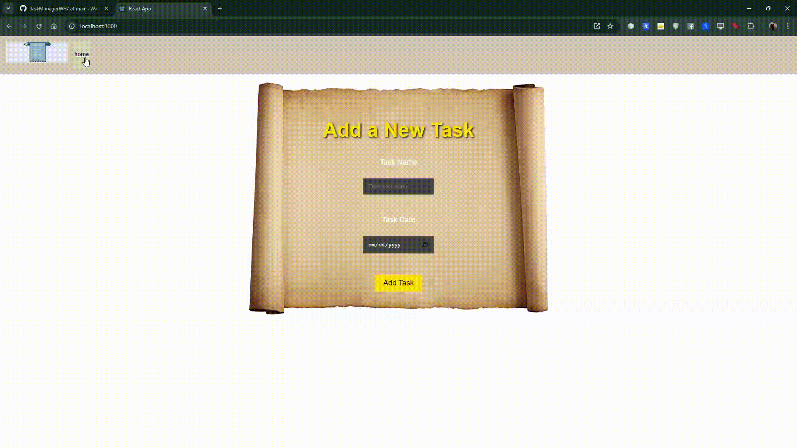

# TaskManagerWH
Javalin JDBC and react APP . This technology is using Javalin API 

## Table of Contents
- [The Website](#the-website)
- [Run Server](#run-server)
- [Client Setup](#client-setup)

## The Website 



## Run Server
- first create and change path of your db  in taskrepository.java
```java
 private static final String DB_URL = "jdbc:sqlite:D:/document_D_Drive/WaiyatReactApp/TaskManagerWH/server/TaskWaiyat.db";
```
- Then run Main.java


## Client Setup
To start your React application in Visual Studio Code using the bash terminal:
1. First, run `npm install` after pulling the project.
2. Install React Router DOM: `npm install react-router-dom`
3. Install Axios: `npm install axios`